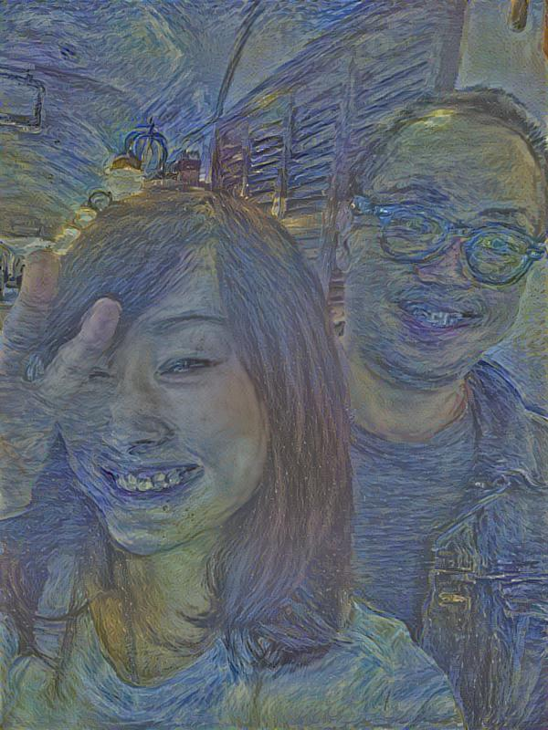
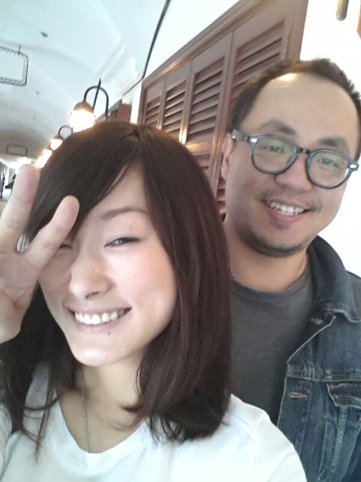

# Neural Style - Valentine's Day Version

I used [simulacre7's work][https://github.com/simulacre7/tensorflow-IPythonNotebook/tree/master/neural-style] and applied it to my own photos.

It's an implementation of [neural style][paper] written in TensorFlow with IPythonNotebook.

## Example 1

These were the input images used (My wife and I in Hong Kong):

## Details

According to simulacre7:

TensorFlow doesn't support [L-BFGS][l-bfgs] whis is the original authors used.
So I use [Adam][adam]. This may require a little bit more hyperparameter tuning to get nice results.

Get Pre-trained VGG network by

`wget http://www.vlfeat.org/matconvnet/models/beta16/imagenet-vgg-verydeep-19.mat`

[paper]: http://arxiv.org/pdf/1508.06576v2.pdf
[l-bfgs]: https://en.wikipedia.org/wiki/Limited-memory_BFGS
[adam]: http://arxiv.org/abs/1412.6980
